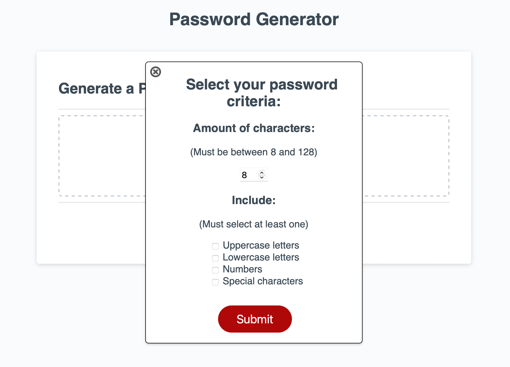

# Password-Generator
A web application that generates a random password based around the user-selected criteria.

## Overview
The purpose of this project was to create a web application that would randomly generate a password for the user, into the textbox, with regards to the user-chosen criteria.

Upon clicking the red "Generate Password" button, the user is prompted with a series of questions regarding their password. They are asked how many characters they would like it to be, if it should include capital letters, lower case letters, numbers, and special characters.

After receiving all this info, the JavaScript file randomly generates a password that meets that criteria.

## What it looks like

## The live page
The live page can be found by clicking [here.](https://tonyq032.github.io/Password-Generator/) 